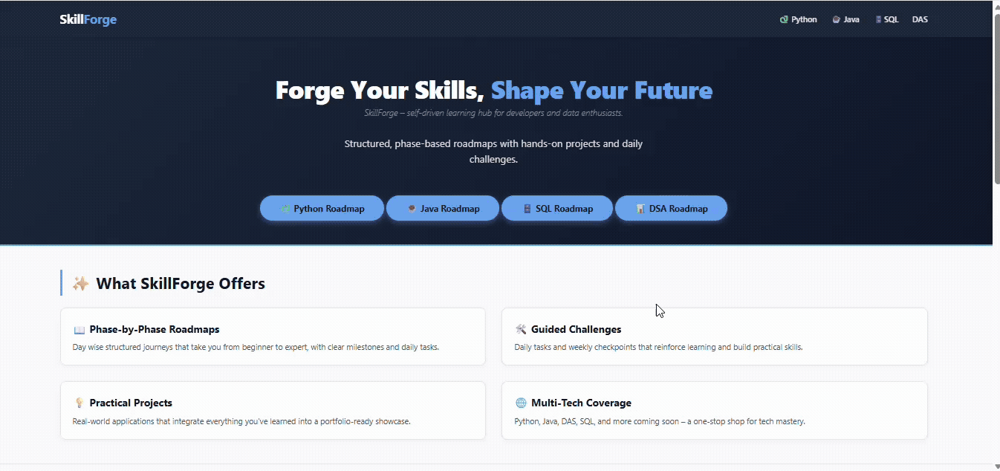

# 🔥 SkillForge - Forge Your Skills, Shape Your Future

> **SkillForge** is a self‑driven learning hub designed to help learners master core technologies step by step.  
> It provides structured, phase‑based roadmaps, guided challenges, and practical projects across multiple domains — starting with **Python, Java, SQL, and DSA**, with more technologies to be added gradually.

[](https://skill-forge-learning.netlify.app)
[](LICENSE)
[]()

---

### 🔴 Live Link: [skill-forge-learning](https://skill-forge-learning.netlify.app)

---

## 🤔 The Motivation Behind SkillForge

> *"I built SkillForge because I saw too many bright minds struggle with the same problem: **'Where do I start?'** "*

As a developer, I noticed that fresh graduates often have scattered resources — a YouTube video here, a blog post there — but no **structured, day‑by‑day path** to follow. I wanted to change that.

SkillForge is my attempt to consolidate the best learning practices into one cohesive platform. Every roadmap is designed to take you from **zero to job‑ready**, with:
- **Clear milestones** so you know exactly where you stand.
- **Hands‑on projects** to build a portfolio that speaks for itself.
- **Interview preparation** (MCQs, Quick Ref guides, DSA) to help you crack those tough coding rounds.

This is not just a collection of links — it's a **guided journey**. I hope it helps you forge the skills you need to shape the future you deserve.

---



---

## 🚀 Features

- 📖 **Phase‑by‑Phase Roadmaps** – 100‑day (and 45‑day) structured journeys.
- 🛠️ **Guided Challenges** – Daily tasks & weekly checkpoints to reinforce learning.
- 💡 **Practical Projects** – Real‑world applications to build your portfolio.
- 🌐 **Multi‑Tech Coverage** – Python, Java, SQL, DSA, with more coming soon.
- 🎯 **Capstone Projects** – Integrate all your skills into one complete system.
- 📝 **MCQ Assessments** – Test your knowledge at Intermediate, Expert, and Professional levels.
- ⚡ **Quick Reference Guides** – Last‑minute cheatsheets for interviews.

---

## 🛤️ Current Learning Tracks

| Track | Duration | Focus Area | Status |
| :--- | :--- | :--- | :--- |
| 🐍 **Python** | 100 Days | Syntax, OOP, Libraries, AI/ML, Full‑stack | ✅ Active |
| ☕ **Java** | 100 Days | Core Java, OOP, Spring Boot, Microservices | ✅ Active |
| 🗄️ **SQL** | 45 Days | Queries, Joins, Optimisation, Database Design | ✅ Active |
| 📊 **DSA** | 50 Days | Data Structures, Algorithms, LeetCode‑style Problems | ✅ Active |

*(More technologies will be added gradually to expand the SkillForge ecosystem.)*

---

## 🧱 Tech Stack (Built With)

| Layer | Technologies |
| :--- | :--- |
| **Frontend** | HTML5, CSS3, Vanilla JavaScript |
| **Styling** | Custom CSS, Flexbox, CSS Grid, Prism.js (syntax highlighting) |
| **Deployment** | Netlify (free tier) |
| **Version Control** | Git & GitHub |

---

## 📁 Repository Structure

```text
SkillForge/
├── index.html # Landing page (hub)
├── README.md # This file
├── assets/
│ ├── css/
│ │     ├── style.css # Shared styles
│ │     └── roadmap-style.css # Roadmap‑specific styles
│ └── js/
│       ├── script.js # Shared functions (copy, etc.)
│       └── roadmap-script.js # Phase/day navigation logic
├── python-roadmap/ # Python 100‑day roadmap
│       └── index.html
├── java-roadmap/ # Java 100‑day roadmap
│       └── index.html
├── sql-roadmap/ # SQL 45‑day roadmap
│       └── index.html
└── dsa-roadmap/ # DSA 50‑day roadmap
        └── index.html
```

---

## 🏗️ Future Roadmap

- ✅ Python, Java, SQL, DSA tracks (complete)
- 🔜 **Modern Web Development** (JavaScript + React) – *Next up*
- 🔜 **DevOps & Cloud** (Docker, Kubernetes, AWS)
- 🔜 **Full‑Stack Project** – Combine frontend + backend + DB
- 🔜 **Community Contributions** – Open to pull requests!

---

## 🚀 How to Run Locally

1. **Clone the repository**
   ```bash
   git clone https://github.com/manojsatna31/skill-forge-learning.git
   cd skill-forge-learning
   ```
2. **Open `index.html` in your browser** (or use a local server for better experience).
3. **Navigate through the roadmaps** and start your learning journey!
4. **Optional:** Use VS Code Live Server extension for a smoother experience.

## 🤝 Contributing
#### We welcome contributions! Whether it's:
- Fixing a bug
- Improving a roadmap section
- Adding a new technology track
- Enhancing the UI/UX
- Writing documentation
#### Please read our CONTRIBUTING.md guide and open a pull request.
